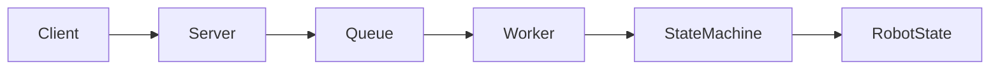
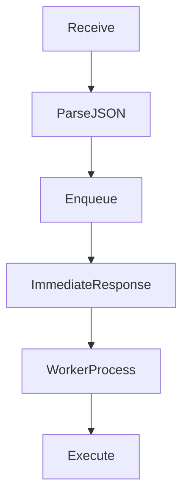
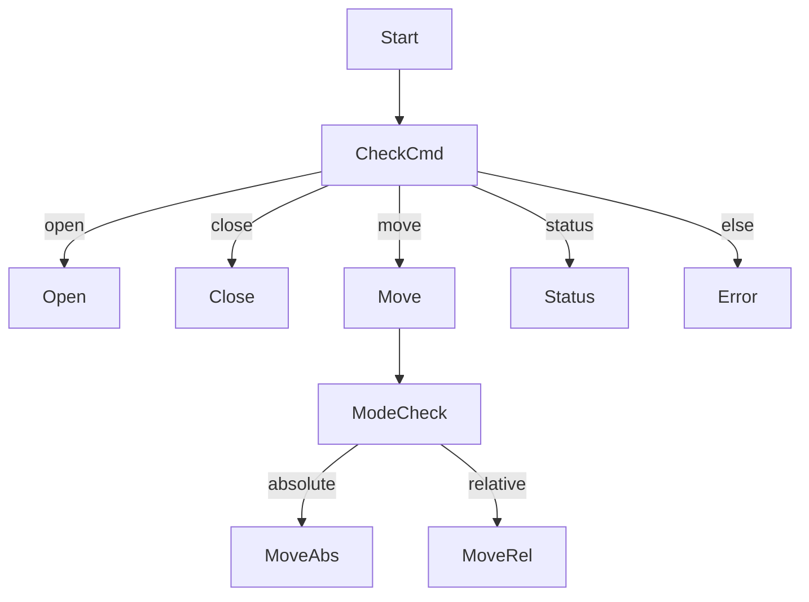

# Robot Control System (Learning Project)

## 1. Overview
This project implements a TCP-based robot control system using a state machine and JSON protocol.

The goal is to design a **scalable robot command interface**, not just simple socket communication.
### Why this project?
This project is designed to simulate a real embedded control system:

- Communication layer (TCP)
- Command abstraction (JSON protocol)
- Execution layer (State machine)

The goal is to demonstrate system-level design capability,
not just socket programming.

---
## 2. System Architecture
Client (CLI)
→ TCP Socket
→ Server
→ State Machine
→ Robot State

- Client: sends commands in JSON format
- Server: handles TCP communication
- State Machine: processes commands
- Robot State: maintains current state (OPEN/CLOSED, angle)

### Real-world relevance
- Similar to robot command interface design
- Applicable to MCU ↔ PC communication systems
- Can be extended to RTOS-based task/queue architecture

### Async Processing Model (v0.5)
This system adopts a producer-consumer architecture:
- Server acts as a producer (receives commands)
- Queue buffers incoming commands
- Worker thread consumes and processes commands

This decouples communication from execution,
improving scalability and system stability.

This structure is similar to:
- RTOS task queue model
- Robot control pipeline
- Distributed command processing systems

---
### 2.1 System Overview

### 2.2 Command Processing Flow

### 2.3 State Machine Design

---
## 3. Command Protocol
- Basic Commands
{"cmd": "open"}
{"cmd": "close"}
{"cmd": "status"}

- Move Command (v0.4)
{"cmd": "move", "mode": "absolute", "angle": 30}
{"cmd": "move", "mode": "relative", "delta": 10}

- Description
absolute: move to target angle
relative: move from current angle

---
## 4. Features
TCP client-server communication
JSON-based command protocol
State machine-based command handling
Input validation (type / range)
Extended command interface (absolute / relative move)

NEW (v0.5)
- Asynchronous command processing (Queue-based)
- Worker thread for command execution
- Decoupled communication and execution layers
- Pytest-based verification for core state machine logic

---
## 5. How to Run
### 1. Server
cd ~/getting_start
python3 src/robot/server.py

### 2. Client
cd ~/getting_start
python3 src/robot/client.py

### 3. Example
move absolute 30
move relative 10
status

---
## 6. Version History
### v0.5 (2026-03-18 23:20)
- Introduced queue-based asynchronous processing
- Implemented worker thread (producer-consumer model)
- Decoupled server I/O from command execution
- Verified core state machine logic with pytest before server refactoring
- Improved system scalability and structure

### v0.4 (2026-03-18 16:45)
- extended move command (absolute / relative)
- improved command protocol design
- response format consistency

### v0.3(2026-03-18 13:20)
- Added move command with angle parameter
- Expanded robot state with angle value
- Added input validation for move command

### v0.2(2026-03-18 08:30)
- JSON-based command protocol implemented
- TCP client-server communication established
- State machine integrated with server

### v0.1
- Basic state machine implemented
- CLI-based command input

## Versioning Strategy
This project uses a simple versioning scheme:
- v0.x : Feature-based development stage

---

## 7. Future Plan
- Result feedback mechanism (Polling / Response handling)
- Multi-worker scaling
- Command execution tracking
- Simulation integration
- ROS2 integration (future)